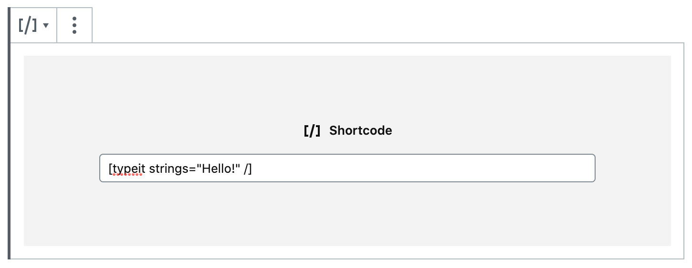

This is the documentation is for TypeIt's official WordPress plugin. Install the plugin and easily generate typewriter animations via shortcode or Gutenberg block.

### Requirements

The following are required to run this plugin. In addition, keep in mind that TypeIt does not support legacy browsers like Internet Explorer.

- WordPress v5.4.1
- PHP v7.2

### Installation

1. Download the plugin and upload to your plugins directory, or install the plugin through the WordPress plugins page. As a premium plugin, WP TypeIt is only available for upload as a `.zip` file. You cannot install it through the WordPress Plugin Directory.
2. Activate the plugin on the 'Plugins' page. After doing so, it should look something like this:


## Using the Plugin

There are two ways to create an effect with WP TypeIt -- a shortcode or Gutenberg block.

### Using a Shortcode

To create an animation with the shortcode, open up any post or page, and paste some variation of the following using the "shortcode" block:



#### Attributes

You can set an attribute on the shortcode for each basic [option](https://typeitjs.com/docs#options) accepted by TypeIt. For example, to set the speed of the animation, specify a `speed` attribute:

```
<h2>[typeit strings="Look, I'm typing a string!" speed="500"]</h2>
```

Or to make it continuously loop, use `loop`.

```
<h2>[typeit strings="This is a string that will loop!" speed="100" loop="true"]</h2>
```

#### Specifying a Container Element

By default, a `<span>` tag will be used to house the animation, but you can set your own by passing an `element` attribute:

```
[typeit strings="This will be in an H1." element="h1"]
```

#### Creating Fine-Tuned Animations via Shortcode

If, for whatever reason, you're in need of maximum control of an animation via shortcode, you can leverage the `queue` attribute. Using this, you can pass a customized queue of actions using [core TypeIt instance methods](https://typeitjs.com/docs/vanilla/instance-methods). To use this feature, inject a string of instance method calls like below:

```
[typeit speed="50" queue="type('This will be typed!').pause(1000).type('...and now it will go away.').pause(1000).delete()"]
```

This chain of methods is injected directly into the generated instance. As a result, make sure it neither starts nor ends with any special characters (like `;` or `.`).

#### Alternate Way to Define Strings

If, for some reason, you don't want to set strigs via the `elements` attribute, you can place strings directly inside the shortcode itself.

```
[typeit speed="300"]This string will exist in your HTML, and when the page is loaded, TypeIt will take over and animate it.[/typeit]
```

When the tag is rendered, that string will be hard-coded on the page, rather than stored in memory on page load. The advantage to this approach is that web crawlers will be able to parse the text without JavaScript, making the content a bit more SEO-friendly.

### Using a Gutenberg Block

You may also create an animation using the Gutenberg block, which let's you more easily fine-tune an animation by adding individual strings, deleting characters, pausing, and more.

#### Add a Block to a Page

To do so, add a block and search for "TypeIt":

<div style="max-width: 400px; margin: 0 auto;">
  
</div>

#### Build an Animation

After selecting the block, you'll be ready to create your animation. The block will allow you choose an element to contain the animation, as well as different actions to queue for the effect. Currently, you can choose from "type", "delete", "move", "break", "pause", and "empty." For more information on what these actions do, [see here](https://typeitjs.com/docs#method-descriptions). After creating your actions, you can rearrange them by dragging them to a desired order.


## Update the Plugin

To update the plugin, navigate to the plugins page in the WP admin and check if an update message is shown. If so, click the appropriate link to download the latest version of the plugin.


## Changelog

### 1.0.0

- Initial release.

### 1.0.1

- Improve documentation.
- Add unit testing for increased code reliability.
- Fix bug causing camel-cased shortcode attributes to work improperly.

### 1.0.2

- Improve code structure.
- Make code more easily hookable for developers.

### 2.0.0

- Introduce Gutenberg block.
- Add support for the `element` attribute in a shortcode.

### 2.0.1

- Improve styling for improved usability.
- Add missing shortcode option for `waitUntilVisible`.

### 3.0.0

- Update core TypeIt library to v8+.
- Fix bug causing inaccurate plugin update alerts.
- Clean up styling.
- Add `queue` shortcode option for customizing animations using full TypeIt API.
